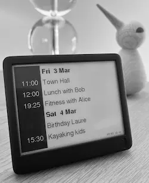

# PaperCal

PaperCal is a calendar application for [Paperd.Ink](https://paperd.ink/) Classic devices. This app connects to your existing [CalDAV](https://en.wikipedia.org/wiki/CalDAV) calendar and displays the upcoming events for a quick and convenient way to stay on top of your schedule.

PaperCal is under development, it works for me but is not production ready software.

Currently, PaperCal only supports the Paperd.Ink Classic – the Merlot hasn’t been tested (I don’t own one). If you’d like to see support added for the Merlot, feel free to open a GitHub [issue](https://github.com/cimm/papercal/issues).

<p align="center">
  
</p>

## Installation

You can use the Arduino IDE to compile and upload the sketch, but I prefer the [arduino-cli](https://arduino.github.io/arduino-cli/0.29/). First clone this git repository:

```sh
git clone https://github.com/cimm/papercal.git --depth 1
```

Make sure to update your WiFi and CalDAV creates in the `papercal/config.hpp` file. This lets PaperCal connect to your calendar and network.

We’ll use the arduino-cli tool to compile and upload the code. If you haven’t already, follow these steps to set up the ESP32 board and install the required libraries:

```sh
arduino-cli config init
arduino-cli config set board_manager.additional_urls https://dl.espressif.com/dl/package_esp32_index.json
arduino-cli core update-index
arduino-cli core install esp32:esp32
arduino-cli lib install GxEPD2@1.6.4
```

Finally, compile and upload the sketch:

```sh
arduino-cli compile --fqbn esp32:esp32:esp32:PartitionScheme=no_ota
arduino-cli upload -p /dev/ttyUSB0 --fqbn esp32:esp32:esp32
```

The partition scheme wasn’t necessary before, but a year later, we ran out of space on the board. Switching to a different partition scheme freed up some room (see `arduino-cli board details --fqbn esp32:esp32:esp32` for details). I suspect one of the libraries might have been updated and now takes up more space now.

After uploading, the board will restart. Wait a few seconds, and if everything went well, you should see your upcoming events. If you get an error like ‘Could not open /dev/ttyUSB0’, you might not have permission to access the USB port. Try changing the permissions and uploading again.

```sh
sudo chmod a+rw /dev/ttyUSB0
arduino-cli upload -p /dev/ttyUSB0 --fqbn esp32:esp32:esp32
```

Use the Arduino Serial Monitor extra debug info:

```sh
arduino-cli monitor -p /dev/ttyUSB0
```

## Known Issues

- Only the Synology Calendar CalDAV implementation is tested. File a bug if your CalDAV server does not work.
- Only ASCII is supported. This limits the display of some characters. Full UTF-8 support would take up too much of the program storage space.

## Acknowledgement

A good chunk of the code is inspired on the official [Paperd.Ink Library for Arduino](https://github.com/paperdink/PaperdInk-Library). Besides the libraries above, it also includes a copy of the [TinyXML2](https://github.com/leethomason/tinyxml2) parser.
